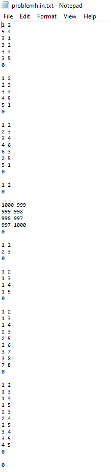
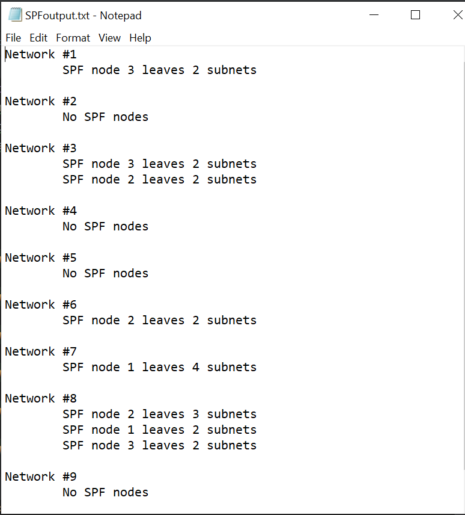
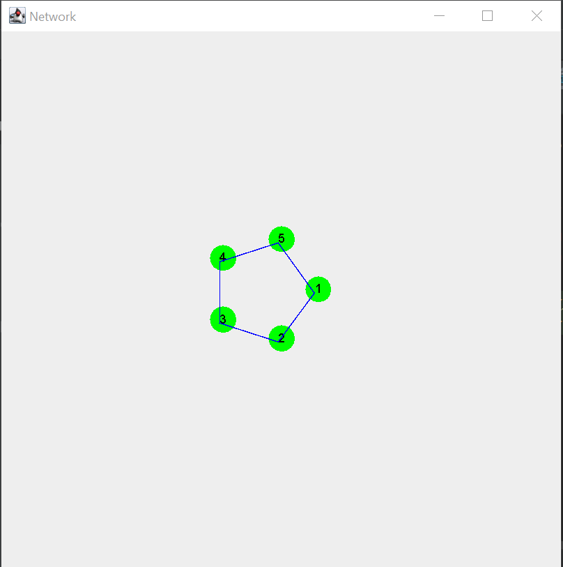
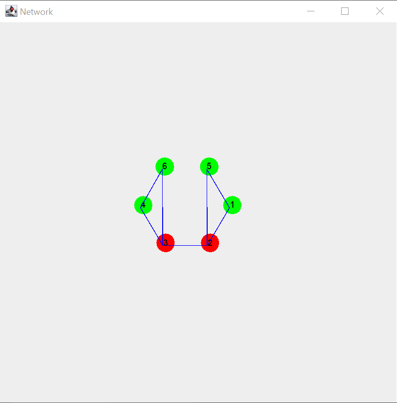
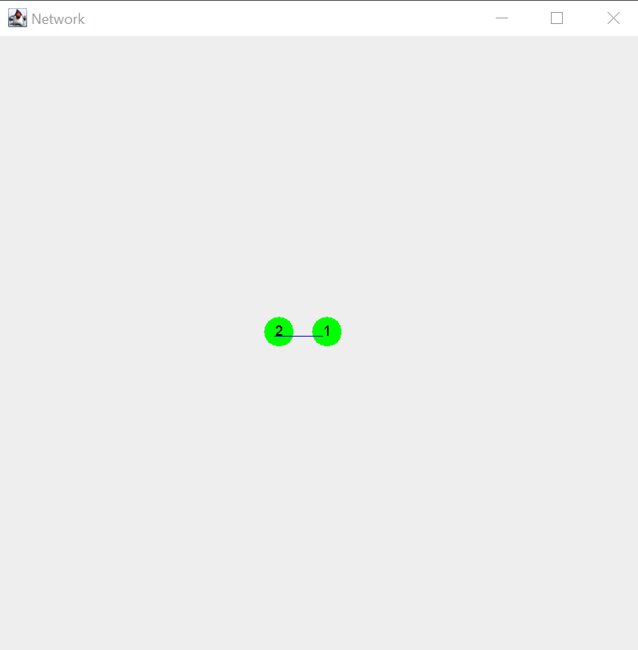
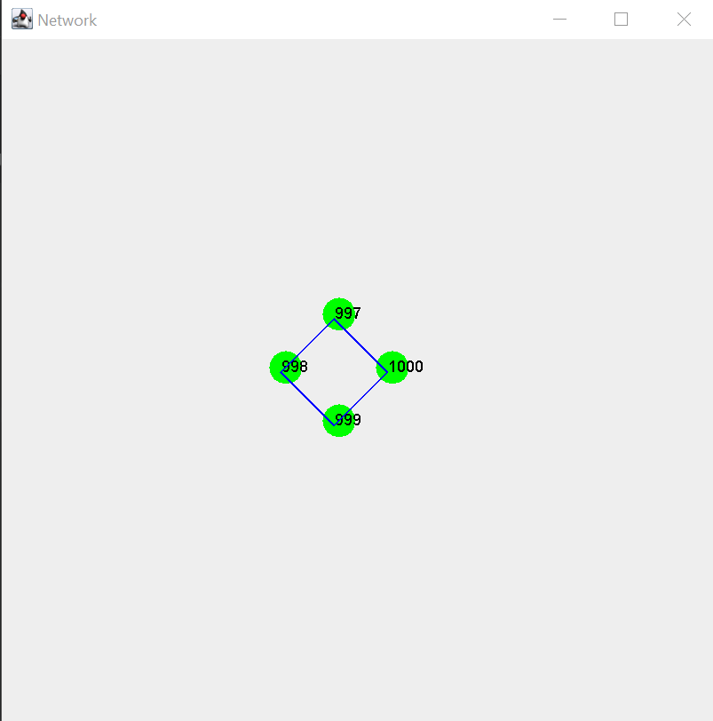
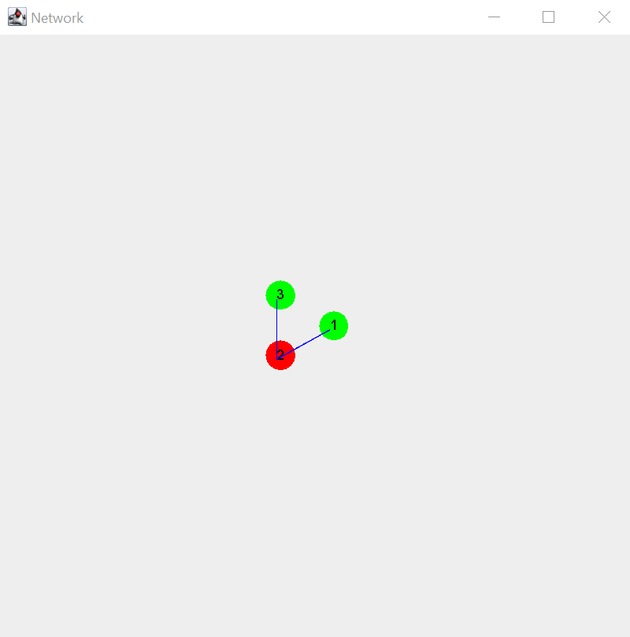
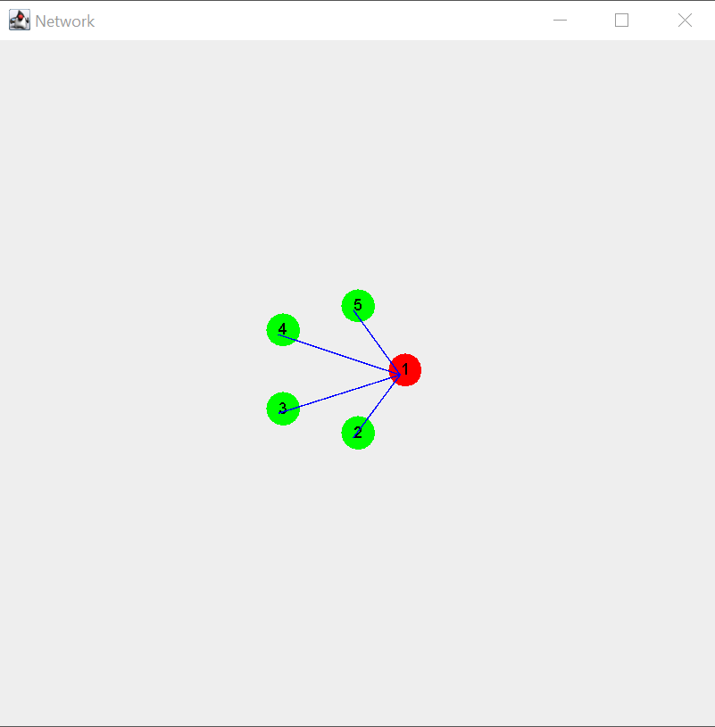
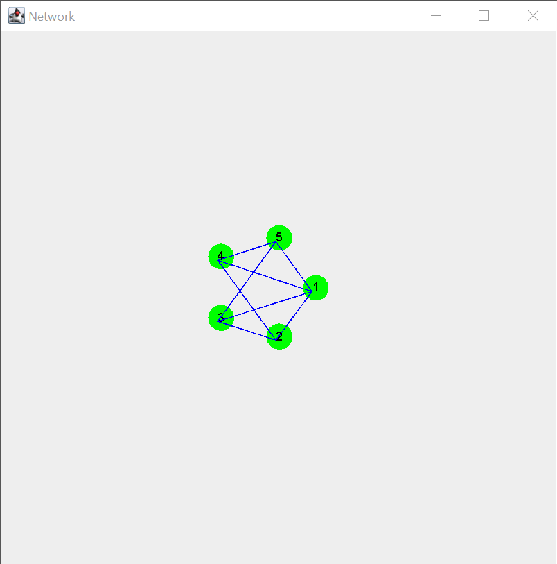
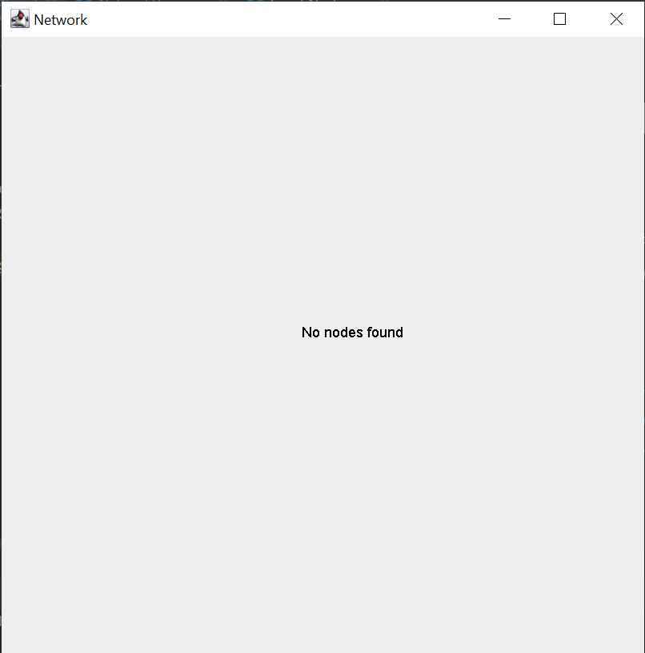

# Single Point of Failure
Implementation of Single Point of Failure identification by Touro students in MCO364.

### Contributors
Tamar Aufrichtig (https://github.com/TamarAuf)    
Lillian Liebman (https://github.com/lliebman)  
Sara Orlian (https://github.com/SaraOrlian)

For every set of nodes per network provided on the input file, a file is produced that states the SPF's and Subnets for each network, and a visual graph is shown for each set of points.

